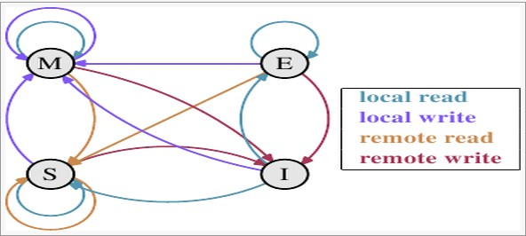

# 一、基本概念

## 1、并发

​	同时拥有两个或者多个线程，如果程序在单核处理器上运行，多个线程将交替的换入或者换出内存，这些线程是同时 ”存在“ 的，每个线程都处于执行过程中的某个状态。如果运行在多核处理器上，此时，程序中的每个线程都将都将分配到一个处理器核上，因此可以同时运行。

多个线程操作相同的资源，保证线程安全，合理使用资源

## 2、高并发

​	高并发（High Concurrency）是互联网分布式系统架构设计中必须考虑的因素之一，它通常是指：通过保证系统能够**同时并行处理**很多请求

服务能同时处理很多请求，提高程序性能


# 二、并发编程的基础

## 1、CPU多级缓存

Main Memory：主存

Bus：系统总线

Cache：高速缓存

CPU Core：CPU 核心

L1 Cache：一级或者二级缓存


## 2、为什么需要CPU cache

CPU的频率太快了，快到主存跟不上，这样在处理器时钟周期内，CPU常常需要等待主存，浪费资源。所以cache的出现，是为了缓解CPU和内存之间速度的不匹配问题。（存储速度：CPU > cache > memory）

## 3、CPU cache 有什么意义

1）时间局部性：如果某个数据被访问，那么在不久的将来它很可能被再次访问。

2）空间局部性：如果某个数据被访问，那么与它相邻的数据很快也可能被访问。

## 4、CPU 多级缓存 - 缓存一致性（MESI）

### 1）用于保证多个CPU cache之间缓存共享数据的一致


| 状态                | 描述                                                         | 监听任务                                                     |
| :------------------ | :----------------------------------------------------------- | :----------------------------------------------------------- |
| M 被修改 (Modified) | 该缓存行只被缓存在该CPU的缓存中，数据是被修改过的，和主内存中的数据不一致，该数据会在未来的某个时间点写回到主存中，数据被写回主存之后，状态变成E | 缓存行必须时刻监听所有试图读该缓存行相对就主存的操作，这种操作必须在缓存将该缓存行写回主存并将状态变成S（共享）状态之前被延迟执行。 |
|                     |                                                              |                                                              |
| E 独享(Exclusive)   | 缓存行只被缓存在该CPU的缓存中，是未被修改过的，与主存 中的数据一致。如果被其他CPU读取就会变成S状态 | 缓存行也必须监听其它缓存读主存中该缓存行的操作，一旦有这种操作，该缓存行需要变成S（共享）状态。 |
|                     |                                                              |                                                              |
| S 共享 (Shared)     | 该缓存行中的数据被多个CPU进行缓存，并且数据与主存中的数据一致，如果某个CPU更改了数据，其他CPU中该缓存行就会变成I状态 | 缓存行也必须监听其它缓存使该缓存行无效或者独享该缓存行的请求，并将该缓存行变成无效（Invalid）。 |
|                     |                                                              |                                                              |
| I 无效 (Invalid)    | 该Cache line无效。                                           | 无                                                           |

local read：读本地缓存中的数据

local write：将数据写到本地缓存中

remote read：将主存中的数据读取到

remote write：将数据写回到主存中

>Local Read表示本内核读本Cache中的值，Local Write表示本内核写本Cache中的值，Remote 
>Read表示其它内核读其它Cache中的值，Remote Write表示其它内核写其它Cache中的值，箭头表示本Cacheline状态的迁移，环形箭头表示状态不变。




## 5、CPU乱序执行优化

### 	1）什么是乱序执行优化？

> 处理器为提高运算速度而做出违背代码原有顺序的优化


6、Java内存模型（Java Memory Model，JMM）

> 规定了一个线程如何和何时可以看到由其他线程修改过后的共享变量的值以及在必须时如何同步的访问共享变量

### 1）堆（Heap）

优点：可以动态分配内存大小，生存期也不必事先告诉编译器

缺点：由于是动态分配内存大小，所以存取速度慢一些

### 2）栈（Stack）

优点：存取速度仅次与CPU的寄存器，栈中的数据是共享的

缺点：栈中的数据内存大小与生存期必须是固定的


### 3）数据存储位置 

基本数据类型存储在栈中，对象的引用存储在栈中，对象中的方法的本地变量存储在栈中

对象的本身存储在堆中，对象的成员变量存储在堆中，静态成员变量存储在堆中


## 7、Java内存模型 -  同步八种操作

lock（锁定）：作用于主内存的变量，把一个变量标识为一条线程独占状态

unlock（解锁）：作用于主内存的变量，把一个处于锁定状态的变量释放出来，释放后的变量才可以被其他线程锁定。

read（读取）：作用于主内存的变量，把一个变量值从主内存传输到线程的工作内存中，以便随后的load动作使用

load（载入）：作用于工作内存的变量，它把read操作从主内存中得到的变量值放入工作内存的变量副本中

use（使用）：作用于工作内存的变量，把工作内存中的一个变量值传递给执行引擎

assign（赋值）：作用于工作内存的变量，它把一个从执行引擎接收到的值赋值给工作内存的变量

store（存储）：作用于工作内存的变量，把工作内存中的一个变量的值传送到主内存中，以便随后的write的操作

write（写入）：作用于主内存的变量，它把store操作从工作内存中一个变量的值传送到主内存的变量中

## 8、Java内存模型 - 同步规则

1）：如果把一个变量从主内存复制到工作内存，就需要按顺序地执行read和load操作，如果把变量从工作内存中同步回主内存中，就要按顺序地执行store和write操作。但Java内存模型值要求上述操作必须按顺序执行，而没有保证必须是连续执行

2）：不允许read和load、store和write操作之一单独出现

3）：不允许一个线程丢弃它的最近assign的操作，即变量在工作内存中改变了之后必须同步到主内存中

4）：不允许一个线程无原因地（没有发生过任何assign操作）把数据从工作内存同步回主内存中

5）：一个新的变量只能从主内存中诞生，不允许在工作内存中直接使用一个未被初始化（load或assign）的变量，即就是一个变量实施use和store操作之前，必须先执行过了assign和load操作

5）：一个变量在同一时刻只允许一条线程对其进行lock操作，但lock操作可以被同一条线程重复执行多次，多次执行lock后，只有执行相同次数的unlock操作，变量才会被解锁。lock和unlock必须成对出现

6）：如果对一个变量执行lock操作，将会清空工作内存中此变量的值，在执行引擎使用这个变量前需要执行load或assign操作初始化变量的值

7）：如果一个变量事先没有对lock操作锁定，则不允许对它执行unlock操作，也不允许去unlock一个被其他线程锁定的变量

8）：对一个变量执行unlock操作之前，必须先把此变量同步到主内存中（执行store和write操作）


## 9、并发的优势与风险


# 三、线程安全性

## 1、什么样的类是线程安全的

当多个线程访问某个类时，不管运行时环境采用**何种调度方式**或者这些进程将如何交替执行，并且在主调代码中**不需要任何额外的同步或协同**，这个类都能表现出**正确的行为**，那么就称这个类时线程安全的


## 2、线程安全表现的3个方面

1）原子性：提供了互斥访问，同一时刻只能有一个线程来对它进行操作

2）可见性：一个线程对主内存的修改可以及时的被其他线程观察到

3）有序性：一个线程观察其他线程中的指令执行顺序，由于指令重排序的存在，该观察结果一般杂乱无序

## 3、原子性

### 1）AtomicInteger & AtomicLong & LongAdder（代码位于Atomic包）

AtomicInteger的incrementAndGet方法底层实现

```java
    public final int incrementAndGet() {
        return unsafe.getAndAddInt(this, valueOffset, 1) + 1;
    }
```

getAndAddInt()方法实现

```java
//第一个参数：当前对象
//第二个参数：当前值
//第三个参数：需要增加的值
public final int getAndAddInt(Object var1, long var2, int var4) {
        int var5;
        do {
            //获取底层的当前值
            var5 = this.getIntVolatile(var1, var2);
            //var1：当前对象
            //var2：当前对象的值
            //var4：需要增加的值
            //var5：该对象底层的值
          	//如果当前对象的值等于底层的值，就将对象的值更新。
            //如果当前值与底层值不符合，就会重新取底层的值与对象的值再进行比较
        } while(!this.compareAndSwapInt(var1, var2, var5, var5 + var4));
        return  ;
    }
```

LongAdder与Atomic比较

Atomic包更新是在一个while循环中，如果线程竞争激烈的时候可能会循环多次，造成性能问题

LongAdder则是将数据分成一个数组，LongAdder则维护数组，可以将热点数据分离，最后求和就可以了。

LongAdder在统计的时候如果有并发更新可能会导致实际统计的数据有一点误差


### 2）锁

synchronized：依赖JVM

Lock：依赖特殊的CPU 指令，代码实现，ReentrantLock

#### ①：Synchronized（代码：synchronizedExample包）

修饰代码块：大括号括起来的代码，作用于调用对象

修饰方法：整个方法，作用于调用对象

修饰静态方法：整个静态方法，作用于所有对象

修饰类：括号括起来的部分，作用于所有对象

### 3）对比

**synchronized**：是不可中断锁，适合竞争不激烈，可读性好

**Lock**：是可中断锁，多样化同步，竞争激烈时能维持常态

Atomic：竞争激烈时能维持常态，比Lock性能好；但是只能同步一个值


## 4、可见性

### 1）什么是线程间的可见性

> 一个线程对主内存的修改可以及时的被其他线程观察到

### 2）导致共享变量在线程间不可见的原因

①：线程交叉执行

②：重排序结合线程交叉执行

③：共享变量更新后的值没有在工作内存与主内存间及时更新 

### 3）JMM（Java内存模型）关于synchronized的两条规定

①：线程解锁前，必须把共享变量的最新值刷新到主内存

②：线程加锁时，将清空工作内存中共享变量的值，从而使用共享变量时需要从主内存中重新读取最新的值（**注意加锁于解锁是同一把锁**）

### 4）volatile

> 通过加入**内存屏障**和**禁止重排序**优化来实现

实现原理

①：对volatile变量写操作时，会在写操作后加入一条store屏障指令，将本地内存中的共享变量值刷新到主内存

②：对volatile变量读操作时，会在读操作前加入一条load屏障指令，从主内存中读取共享变量


LoadLoad屏障：对于这样的语句Load1; LoadLoad; Load2，在Load2及后续读取操作要读取的数据被访问前，保证Load1要读取的数据被读取完毕。

StoreStore屏障：对于这样的语句Store1; StoreStore; Store2，在Store2及后续写入操作执行前，保证Store1的写入操作对其它处理器可见。

LoadStore屏障：对于这样的语句Load1; LoadStore; Store2，在Store2及后续写入操作被刷出前，保证Load1要读取的数据被读取完毕。

StoreLoad屏障：对于这样的语句Store1; StoreLoad; Load2，在Load2及后续所有读取操作执行前，保证Store1的写入对所有处理器可见。**它的开销是四种屏障中最大的。在大多数处理器的实现中，这个屏障是个万能屏障，兼具其它三种内存屏障的功能**


示意图

volatile写操作：


volatile读操作

 

volatile的使用

1、对变量的写操作不依赖当前值

2、volatile变量没有包含在具有其他变量中的不变式中 


## 5、有序性

> Java内存模型中，允许编译器和处理器对指令进行**重排序**，但是重排序过程不会影响到**单线程**程序的执行，却会影响到多线程并发执行的正确性

### 1）happens-before原则

①：程序次序规则：一个线程内，按照代码顺序，书写在前面的操作先行发生于书写在后面的操作

②：锁定规则：一个unlock操作先行发生于后面对同一个锁定lock操作

③：volatile变量规则：对一个变量的写操作先行发生于后面对这个变量的读操作

④：传递规则：如果操作A先行发生于操作B，而操作B由先行发生于操作C，则可以得出操作A先行发生于操作C

⑤：线程启动规则：Thread对象的start()方法先行发生于此线程的每一个动作

⑥：线程中断规则：对线程interrupt()方法的调用先行发生于被中断线程的代码检测到中断事件的发生

⑦：线程终结规则：线程中所有的操作都先行发生于线程的终止检测，我们可以通过Thread.join()方法结束，Thread.isAlive()的返回值手段检测到线程已经终止执行

⑧：对象终结规则：一个对象的初始化完成先行发生于它的finalize()方法的开始


# 四、安全发布对象

## 1、发布对象

> 使一个对象能够被当前范围之外的代码所使用

## 2、对象溢出

代码：publish包

> 一种错误的发布。当一个对象还没有构造完成时，就使它被其他线程所见

## 3、安全发布对象

代码：singleton包

①：在静态初始化函数中初始化一个对象引用

②：将对象的引用保持到volatile类型域或者AtomicReference对象中

③：将对象的引用保存到某个正确构造对象的final类型域中

④：将对象的引用保存到一个由锁保护的域中

## 4、不可变对象

### 1）不可变对象需要满足的条件

①：对象创建以后其状态就不能修改

②：对象所有域都是final类型

③：对象是正确创建的（在对象创建期间，this引用没有溢出）

### 2）final关键字

①、修饰类：不能被继承，该类的所有方法都会被隐式的设置为final方法

②、修饰方法：锁定方法不能被继承类修改

③、修饰变量：基本数据类型变量：初始化值之后就不能修改。引用类型变量：初始化之后不能再指向其他对象

###  3）线程封闭

①：Ad-hoc线程封闭：程序控制，最糟糕的，忽略

②：堆栈封闭：局部变量，无并发问题

③：ThreadLocal线程封闭：特别好的封闭方法（代码位于threadLocal包）

# 五、并发容器   J.U.C

代码：concurrentContainer包

1、ArrayList  -> CopyOnWriteArrayList

**CopyOnWriteArrayList**：在给CopyOnWriteArrayList进行写操作的时候，会先复制一份出来，在新的集合中进行写操作，然后将原来的数组指向新的地址

缺点：

1）因为在写操作的时候需要拷贝，会消耗内存

2）不能用于时时读的场景

2、HashSet、TreeSet -> CopyOnWriteArraySet、ConcurrentSkipListSet

3、HashMap、TreeMap -> ConcurrentHashMap、ConcurrentSkipListMap

ConcurrentSkipListMap相对于ConcurrentHashMap的优点

①：key是有序的

②：支持更高的并发，存取时间与线程数无关，同等数据线程数越多优势越大

# 六、安全共享对象策略 - 总结

1、线程限制：一个被线程限制的对象，由线程独占，并且只能被占有它的线程修改

2、共享只读：一个共享只读的对象，在没有额外同步的情况下，可以被多个线程 并发访问，但是任何线程都不能修改它

3、线程安全对象：一个线程安全的对象或者容器，在内部通过同步机制来保证线程安全，所以其他线程无需额外的同步就可以通过公共接口随意访问它

4、被守护对象：被守护对象只能通过获取特定的锁来访问


# 七、JUC之AQS

代码：aqs包

## 1、AbstractQueuedSynchronizer介绍

①：使用Node实现FIFO队列，可以用于构建锁或者其他同步装置的基础框架

②：利用了一个int类型表示状态

③：使用方法是继承

④：子类通过继承并通过实现它的方法管理其状态  {  acquire 和 release  }的方法操纵状态

⑤：可以同时实现排它锁和共享锁模式（独占、共享）


## 2、CountDownLatch


